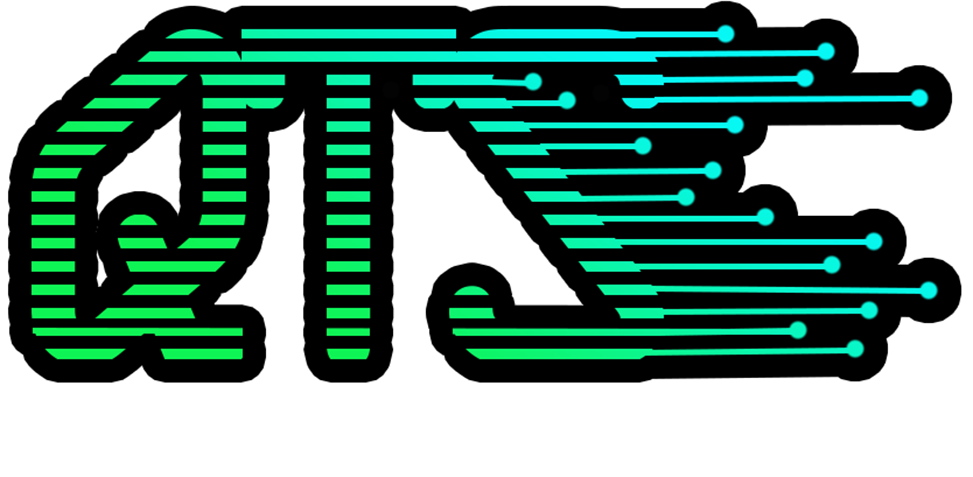

<link rel="stylesheet" href="assets/css/style.css">

# 📍 Quartzion Technology Solutions Corp - Software Development Life Cycle (SDLC) Version 1.0.0

---

## ✅ Overview

The **Quartzion SDLC** defines the structured process for designing, developing, testing, deploying, and maintaining software solutions that align with **Quartzion's mission**:  
*Technology for Humanity | Community Focus | Open Source | Ethical and Sustainable Tech*

This lifecycle ensures delivery of **high-quality**, **ethical**, and **community-centered technology solutions**.

---

## ✅ SDLC Phases

| **Phase** | **Key Activities** | **Deliverables / Outputs** |
|---|---|---|
| **1. Initiation / Ideation** | - Capture ideas from stakeholders - Validate alignment with Quartzion values - Prioritize based on impact | - Approved Idea Brief - Stakeholder Input Notes |
| **2. Requirements Gathering & Analysis** | - Host discussions / workshops - Document functional & non-functional requirements - Define Acceptance Criteria - Include DEI, Accessibility, and Ethical Tech considerations | - Requirements Specification Document (RSD) - Acceptance Criteria |
| **3. Solution Design** | - Create system architecture - Produce UI/UX designs with accessibility standards - Conduct design reviews and threat modeling | - Architecture Diagrams - Wireframes / Prototypes - Design Sign-off |
| **4. Development** | - Implement code following open-source and ethical standards - Perform unit testing - Conduct peer code reviews - Document functionality | - Source Code - Unit Test Results - Code Review Approvals |
| **5. Testing & Quality Assurance** | - Functional Testing - User Acceptance Testing (UAT) with stakeholders/community - Security Testing - Accessibility Testing - Performance Testing | - Test Plans - Test Reports - UAT Feedback |
| **6. Deployment** | - Deploy to staging - Conduct smoke testing - Obtain stakeholder approval - Deploy to production | - Deployment Scripts - Release Notes - Production Confirmation |
| **7. Maintenance & Support** | - Monitor application health - Address bug fixes and hotfixes - Engage with community feedback - Plan for future enhancements | - Issue Logs - Patch Releases - Support Documentation |
| **8. Retrospective / Continuous Improvement** | - Conduct retrospectives post-deployment - Capture lessons learned - Update processes for future projects | - Retrospective Reports - Process Improvement Actions |

---

## ✅ GitHub Projects Strategy

Quartzion leverages **GitHub Projects** to manage work across the SDLC using the following hierarchy:

| **Level** | **GitHub Element**                | **Purpose**                                       |
| --------- | --------------------------------- | ------------------------------------------------- |
| Epic      | Issue labeled `Epic`              | High-level initiative or feature grouping Stories |
| Story     | Issue labeled `Story`             | Detailed user-focused functionality               |
| Task      | Issue labeled `Task` or checklist | Specific development/test/design work             |
| Subtask   | Checklist item or linked issue    | Granular unit of work under a Task                |

- Use **GitHub Projects** (table or board view) to visualize progress
- Automate transitions using **issue states** (open, closed)
- Employ **labels** and **milestones** for filtering, prioritization, and tracking
- Enable cross-functional planning by linking issues across Epics, Stories, and Tasks

---

## ✅ Quartzion SDLC Core Principles

- **Open Source Friendly**: Encourage community contributions and transparency
- **Ethical & Responsible Tech**: Evaluate for social impact, digital inclusion, and data privacy
- **Sustainability Focus**: Optimize infrastructure and reduce waste
- **Accessibility & DEI First**: Design with Web Content Accessibility Guidelines (WCAG) in mind
- **Documentation Driven**: Prioritize clear, reusable documentation
- **CI/CD Pipeline Integration**: Automate builds, tests, and deployments
- **Stakeholder Collaboration**: Engage nonprofit partners, tech volunteers, and end-users

---
## ✅ Visual SDLC Flow

## 🗂️ Epic > Story > Task > Subtask Workflow (GitHub Projects)

```mermaid
graph TD
  EPIC["📘 Epic<br><sub>(project-wide goal)</sub>"]
  STORY1["📗 Story 1<br><sub>(feature or requirement)</sub>"]
  STORY2["📗 Story 2"]
  TASK1["📒 Task 1<br><sub>(engineering unit of work)</sub>"]
  TASK2["📒 Task 2"]
  SUBTASK1["📝 Subtask 1"]
  SUBTASK2["📝 Subtask 2"]
  SUBTASK3["📝 Subtask 3"]

  EPIC --> STORY1
  EPIC --> STORY2
  STORY1 --> TASK1
  STORY1 --> TASK2
  TASK1 --> SUBTASK1
  TASK1 --> SUBTASK2
  TASK2 --> SUBTASK3
```

### 🔖 Strategy Notes
- **Epics** = Labeled as `type: epic`, tracked via milestone or project grouping.
- **Stories** = Linked to epics with `linked issues`; labeled `type: story`.
- **Tasks** = Issues broken down from stories; labeled `type: task`.
- **Subtasks** = Checklist or separate issues with `parent` link to task.

---
 